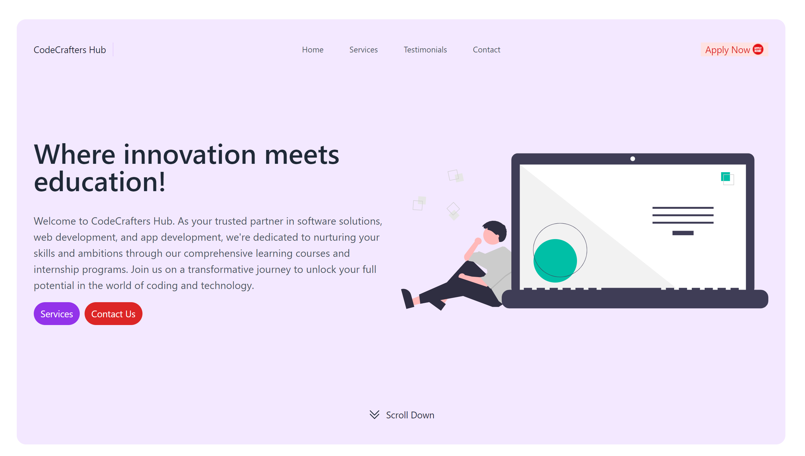

# PRODIGY_WD_01

## TASK 1 RESPONSIVE LANDING PAGE
This repository contains a simple registration for an web application project developed using HTML, CSS, and JavaScript, created as part of my internship at Prodigy infotech

## Overview:
This project is part of the web development internship with Prodigy Infotech. The task involves creating a responsive landing page for the fictitious company, CodeCrafters, using HTML and the Tailwind CSS framework. The goal of this project is to showcase your skills in front-end web development, specifically in creating visually appealing and responsive web pages.



## Task Requirements
1. Responsive Design: The landing page should be fully responsive, ensuring an optimal user experience on various devices, including desktops, tablets, and smartphones.

2. HTML Structure: Utilize proper HTML semantic elements to structure the content logically, making it accessible and SEO-friendly.

3. Tailwind CSS: Implement the Tailwind CSS framework to style the page efficiently and maintainable. Ensure consistent and visually appealing design elements.

4. Content: Create engaging and informative content that highlights CodeCrafters' services, testimonials, and contacts.

5. Navigation: Implement a navigation menu that allows users to explore different sections of the landing page smoothly.

6. Contact Form: Include a contact form or contact information, enabling visitors to get in touch with CodeCrafters easily.

## Project Structure
The project structure is organized as follows:

1. `index.html`: The main HTML file containing the structure and content of the landing page. And it contains tha tailwind css utilities for styles

2. `Image/`: Directory to store images, videos, or other media used in the project.

3. `README.md`: This file, providing an overview and description of the project.

screenshot.png: A screenshot of the CodeCrafters landing page for reference.

## Technologies Used
- HTML5: Used for structuring the registration form.
- CSS3: Applied for styling and responsive design.
- JavaScript: Implemented client-side validation and error handling.
- (Optional) Backend Technology: If applicable, specify the technology used for handling form submissions.


## Usage
To view the landing page, simply open the index.html file in a web browser. You can also deploy it to a web server for online accessibility.


## Getting Started

To get started with the Currency Converter web application, follow these steps:

1. Clone the repository to your local machine:

   ```bash
   git clone https://github.com/HariR1893/PRODIGY_WD_01.git
   ```
2. Navigate to the project directory:
   `cd PRODIGY_WD_01`

3. Start the development server:
    `npm run start`
   
5. The app will open in your default web browser at `http://localhost:3000.`

Feel free to explore and customize this project as you see fit. It's a great way to gain practical experience in web development during your internship at Prodigy Infotech!
